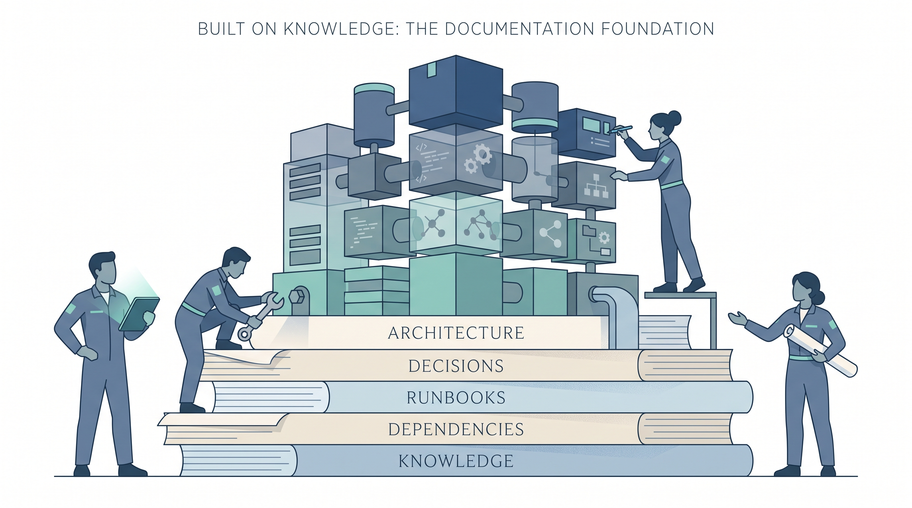
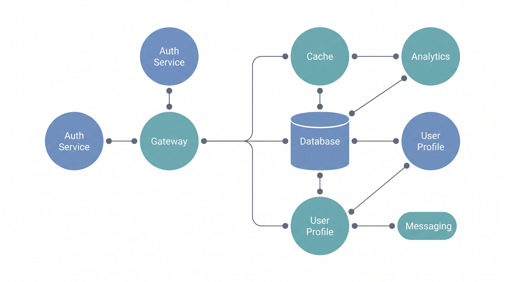
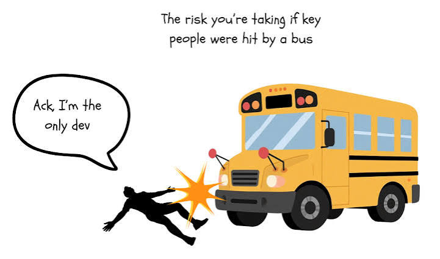

<p align="center"><em> Fig. 1. Documentation foundation illustration </em></p>

A deployment fails at 2 a.m., and the on-call engineer cannot find the rollback steps because the person who wrote them left the team eight months ago. A new hire spends her first week tracing how three microservices communicate because the architecture diagram in the wiki was last updated before the most recent migration.

A one-line configuration change breaks a downstream job because the assumption behind the original setting was never written down. It existed only in the head of the engineer who made the decision.

{/* truncate */}

None of these problems can be solved by looking at the code alone. The code may be behaving exactly as it was designed to behave. What failed was the system’s ability to explain itself to the next person who needed to understand it.

Many long-term system problems are made worse by this same gap. Documentation becomes outdated, important decisions go unrecorded, and information ends up scattered across repositories, tickets, chat messages, and people’s memory. Teams often postpone documentation until the *“real work”* is finished, which usually means it gets written late, written quickly, or not written at all. But when people cannot easily understand how a system works or why it behaves the way it does, even a well-written codebase becomes harder to maintain.

:::tip
Documentation is not separate from engineering. Rather, it is one of the ways engineering knowledge is preserved.
:::

This becomes particularly important as a system grows. Documentation helps teams build a shared understanding of the system, keep increasing complexity manageable, reduce the time spent rediscovering information, and respond more effectively when something goes wrong.

This article looks at why that’s true across four dimensions: how documentation shapes understanding, how it holds off complexity, how it speeds up teams, and how it determines whether a system can be reliably operated when something goes wrong. 

## **Documentation Is Part of the System**

It is easy to think of documentation as comments, a setup guide, and a README — the bare minimum needed to get a new contributor running locally. Those are useful, but they cover only part of what people eventually need to know.

Useful documentation can describe a system’s purpose, its architecture, the workflows around it, what normal operation looks like, and the decisions that shaped it. Different documents serve different readers and different moments. A new developer may need an overview and setup instructions. An operator may need a runbook. A maintainer may need the reasoning behind an architectural decision.

:::tip
That last category is the one teams often skip, and it becomes surprisingly valuable quickly.
:::

There is a difference between documenting ***how*** a system works and documenting ***why*** it was built that way. The implementation can often tell you the former. You can read the code, trace a request, inspect logs, or run a debugger. On the other hand, the reasoning behind a decision is harder to recover.

Consider a rate limiter set to 100 requests per minute. The code can tell you the limit is 100. It may not tell you that the number was chosen because a downstream partner could not reliably handle more traffic, or that a previous attempt to increase the limit contributed to an incident. That context has to be recorded somewhere if you want the next engineer to have access to it.

This is one reason teams use **Architecture Decision Records (ADRs)**: short, dated documents that capture a decision, the alternatives considered, and the reasoning behind the choice. An ADR does not need to become a long design document. Its value is in preserving context that would otherwise be easy to lose. Six months later, reading a few paragraphs about why the team chose eventual consistency may be far easier than trying to reconstruct the decision from code and old conversations.

Code changes constantly, and design intent does not automatically travel with it. Without documentation, teams often end up rediscovering parts of the system every time someone new has to work on them.

## **Complexity Grows Faster Than We Notice**

No system becomes complex in one dramatic step. Usually, it happens gradually: a feature here, a third-party integration there, a configuration flag added for one customer’s edge case, an infrastructure change, a temporary fix that quietly becomes permanent.

Most of those changes are reasonable when introduced. The problem appears later, when the team has to understand how all of them fit together.

When the reasoning behind those changes is not recorded, the system develops a hidden layer of complexity. Dependencies become harder to trace. Two different parts of the codebase may solve the same problem because their authors did not know about each other’s work. A seemingly small refactor starts to feel risky because nobody is sure what else depends on the component being changed.

At that point, debugging becomes more expensive. The problem may not be difficult, but understanding the surrounding system before you can even reproduce the bug takes time. Documentation does not make a complex system simple outrightly. A distributed system will still be distributed, and a large codebase will still contain many moving parts. What documentation can do is make that complexity easier to navigate.


<p align="center"><em> Fig. 2. Dependency map illustration </em></p>

For example, A current dependency map, gives engineers a better idea of what a change might affect before they make it. A service overview can tell a developer where ownership ends and another system begins. An architecture document can provide enough context to understand why a component exists before someone starts trying to replace it.

:::tip
The goal is not a complexity-free system. Rather, it is a system where the complexity that exists is visible enough for people to work with it confidently.
:::

## **Quality Documentation Makes Teams Faster**

The productivity benefit of documentation is easy to underestimate because the cost of poor documentation rarely appears as one obvious event. More often, it is distributed across dozens of small interruptions.

An engineer spends time searching through a repository for one function that actually implements the behavior in question. Someone asks, *“How does authentication work here?”* and gets an answer from the one teammate who happens to remember it. A developer preparing a deployment reconstructs the sequence of commands from an old terminal history because the last deployment happened eleven months ago.

Each event may look insignificant on its own, but over time, lost time adds up.

Good documentation turns some of that repeated effort into self-service work. A service overview can explain what a service owns and what it does not. API documentation can show realistic request and response examples instead of only listing parameters. A deployment guide can provide steps that someone else can follow without having to fill in missing assumptions. A troubleshooting page can connect common errors to the fixes that have actually worked.

The point is not to document every detail of the system. That would be difficult to maintain and, in many cases, difficult to use. The more useful question is: **What information would be expensive for the next person to rediscover?** That is usually where documentation earns its keep. It is also where the audience matters. The best documentation is not written for an abstract *“user.”* It is written for someone trying to accomplish a specific task.

## **Reliability Depends on Shared Understanding**

Productivity is what documentation can improve during normal work. Reliability is where it becomes particularly valuable when something is already broken.

A system that is reliable in practice needs to be understandable, operable, and maintainable by more than one person. Those capabilities become much harder to sustain when the knowledge required to operate the system exists mainly in individual memory.

The [Google SRE Workbook](https://sre.google/workbook/incident-response/) makes a related point in its discussion of incident response: effective response depends on defined roles, clear coordination, and a working record of what is happening and what has been tried. The same principle applies to the operational knowledge that exists before an incident starts. When the answer to *“What do we do when this breaks?”* lives in one person’s memory, the team has a fragile dependency on that person being available.

**This is where runbooks are useful.**

A runbook is not a general description of a system. It is a task-oriented document designed for a specific operational situation. A good runbook should tell the reader what the symptoms look like, what checks to run first, what mitigation or rollback steps are available, and when to escalate.

For example:

```markdown
## Runbook: Webhook Delivery Failure

 **Severity:** P2 — partial customer impact 
 **Owner:** Payments team (#payments-oncall)

 ### Symptoms 
 - Webhook delivery success rate drops below 95%
 - Support tickets referencing missing webhook events

 ### Immediate checks
 1. Confirm the dispatcher service is running:
    kubectl get pods -n webhooks

 2. Check dead-letter queue depth:
    aws sqs get-queue-attributes --queue-url $DLQ_URL --attribute-names ApproximateNumberOfMessages

 3. Review deploys to the dispatcher in the last 2 hours

 ### Mitigation  
 - Dispatcher crash-looping → roll back: 
   kubectl rollout undo deployment/webhook-dispatcher

 - DLQ backing up → drain and requeue:
   ./scripts/requeue-dlq.sh --queue webhook-dlq

 ### Escalation
 Unresolved after 20 minutes → page the on-call payments engineer.
```

:::note
The specific tools differ from system to system. The structure is what matters.
:::

Notice what this document is not. It does not explain how the payment dispatcher was designed or why the team chose its current architecture. Those belong in other documentation. The runbook has a narrower job: help an engineer take the next useful action when an alert fires, potentially under pressure and without the context of the person who originally built the system.

That distinction matters. During an incident, a short document that answers the immediate questions is often more useful than a comprehensive document that takes several minutes to interpret.


<p align="center"><em> Fig. 3. Bus factor illustration </em></p>

This also connects to the idea of **Bus factor**: the degree to which a system depends on a small number of people having unique knowledge. A bus factor of one means a critical part of the system depends on a single person. Documentation is not the only way to reduce that risk — shared ownership, code reviews, and pairing can too — but it is one of the simplest ways to move important knowledge out of individual memory and into a form the rest of the team can use.

:::tip
When knowledge exists only in people’s heads, system reliability depends on who is available.
:::

## **What Good Documentation Looks Like**

Good documentation does not have to be exhaustive. In many cases, trying to document everything creates another maintenance problem: the more information a document contains, the more opportunities there are for parts of it to become outdated.

What matters more is whether the documentation is **clear, current, discoverable, task-oriented, and written for a specific audience**.

For a typical system, a lightweight structure can cover most of what an engineer needs without becoming a large documentation project:

| Section | Answers |
| :---- | :---- |
| Overview | What does this system do, and who depends on it? |
| Architecture | How are the pieces organized, and how do they communicate? |
| Running it | How do you build, deploy, and configure it locally and in production? |
| Troubleshooting | What breaks most often, and what fixes it? |
| Decisions | What assumptions and trade-offs would surprise someone new? |

Two documentation problems appear repeatedly at opposite ends of the spectrum. The first is documentation that is too thin to be useful: a README with an install command and little else. It may get someone started, but it leaves important questions unanswered.

The second is documentation that becomes so large and detailed that it is difficult to maintain. After a few releases, parts of it drift away from the system. Once readers notice that, they become less likely to trust the document, and the team starts relying on direct questions and personal knowledge again.

:::tip
The answer is not simply to write more. It is to make documentation part of the work that changes the system.
:::

When a pull request changes user-facing behavior, the relevant documentation should be considered part of that change. When an operational procedure changes, the runbook should change with it. When an architectural decision introduces an important trade-off, record the reasoning while the context is still fresh.

This is the idea behind **Docs-as-code**: keeping documentation in version control and using familiar code development practices such as pull requests and reviews to maintain it. The exact tooling can vary, but the underlying principle is straightforward: documentation should evolve alongside the system instead of being maintained as a separate, occasional activity.

## **Conclusion**

Documentation is easy to treat as secondary because a system can continue running without anyone reading its docs. However, the problem often appears later, when someone has to understand an unfamiliar component, change a risky part of the system, respond to an incident, or take over work from someone who is no longer available.

Good documentation preserves decisions and context. It reduces the time spent rediscovering information that someone already worked out once. It gives different teams a shared reference point, and it provides operational guidance when there is little time to piece things together from scratch. The goal is not to document everything. Rather, it is to make important system knowledge available when and where people need it.

## **Glossary**

**Wiki**  
A collaborative collection of web pages that teams can create and update to document knowledge, processes, systems, and internal information.

**README**  
A file, usually placed at the root of a software repository, that explains what a project is, how to set it up, how to use it, and other information contributors or users need to get started.

**Runbook**  
A step-by-step guide for performing operational tasks, such as deploying a service, responding to an alert, troubleshooting a failure, or recovering a system.

**Architecture Decision Record (ADR)**  
A short document that records an important architectural or technical decision, including the context, alternatives considered, reasoning, and consequences of the decision. ADRs preserve the reasoning behind a system's design choices.

**Dependency**  
A component, service, library, tool, or external system that another part of a system relies on to function.

**Dependency Map**  
A visual or structured representation of the relationships between components and their dependencies. A current dependency map reflects how those relationships exist in the system now, making it easier to understand what may be affected when a component changes or fails.

**Bus Factor**  
A measure of how many people can become unavailable before a team loses critical knowledge or its ability to continue a particular task. A low bus factor indicates that important knowledge is concentrated among very few people.

**Docs-as-Code**  
An approach to documentation that applies software development practices, such as version control, code review, automated testing, and CI/CD, to writing and publishing documentation.

**Incident Response**  
The process of detecting, investigating, containing, and recovering from a system failure or other operational incident.