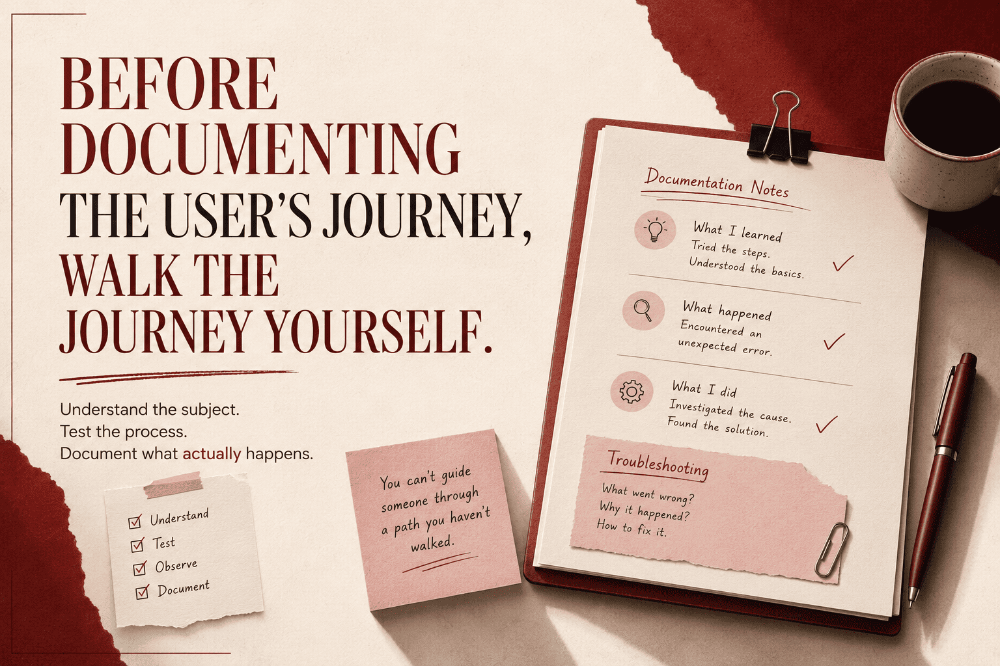

# **Before documenting the user's journey, walk the journey yourself.**

Recently, I've been working on a two-part tutorial docs and I just finished mine. The subject matter was quite technical, but it is something I'm well conversant with. Before writing, I did something I consider important:

{/* truncate */}

I walked through the entire process myself and documented along the way. That helped me make sure every step was covered with the right explanations, images, examples, and code samples.

Everything started well. I performed the first few steps and documented them appropriately. Then something unexpected happened. A one-line command that normally works fine returned an error. Like I said, I'm well conversant with the subject matter, this wasn't my first time going through the process. I knew what the command was supposed to do. But this time, it didn't.

Now, if I had no idea about the process, or didn't perform the steps myself, I'd have been stuck at the point or missed the error. I went through the error log and discovered exactly what the problem entailed. It wasn't with the installation, configuration or any manually-executed step. Rather, it was embedded within the often overlooked part of the process. I eventually resolved the issue, but didn't stop there. I documented the scenario as a troubleshooting case so that a first-time user who encounters the same problem, can read the docs and resolve it right away.

Here's what I'm driving at:

As technical writers, we shouldn't just document what we think should happen. We should also perform the process ourselves and document what actually happens.  
Knowing the subject matter is important. But first-hand experience with the process is what helps you identify the gaps, unexpected errors, and practical problems that a reader may encounter.  
Before documenting the user's journey, walk the journey yourself.
