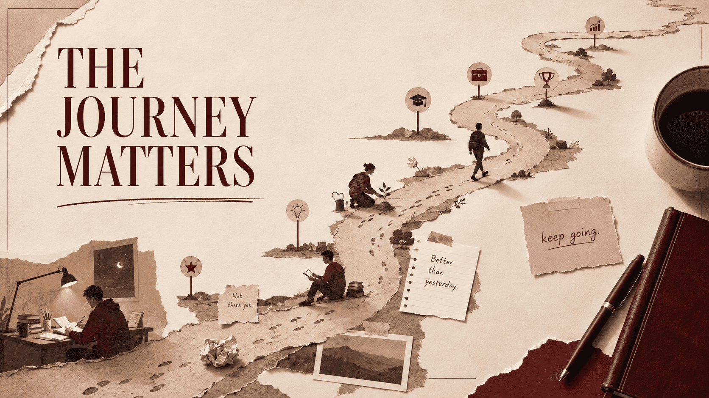

# **The juice of life is in the overall process, not the results.**

This idea is about where meaning and fulfillment actually come from. At its core, it challenges the common belief that happiness is waiting at the finish line. Many people live with this mental equation:

{/* truncate */}

- "When I achieve X, I will be happy."
- "When I pass this exam, I will relax."
- "When I become successful, I will finally enjoy life."
- "When people recognize me, I will feel valuable."

But the underlying problem is that *results are always temporary destinations.* Once we reach one, our mind immediately creates another target. For example:

- You graduate, then you want a job.
- You get the job, then you want a promotion.
- You get promoted, then you want more influence.

The finish line keeps shifting. But the process, however, is where life is actually experienced.

### **Results are moments, but processes are experiences:**

A result is usually a single point in time, like winning a competition which may only take seconds. But the process behind the scenes contains; the late nights studying, failures, discipline, moments of doubt, small improvements and other experiences.

### **The process is where identity is built**

Results tell what is achieved, but the process reveals the transformation. For example, someone who scores 100% in an exam has an achievement. But someone who developed discipline, curiosity, resilience, and consistency while preparing has developed a character. This is why two people can achieve the same result but have completely different experiences.

### **Loving the process creates mastery:**

Almost every great person in any field eventually discovers this.

- Athletes do not love only trophies, they equally love training.
- Musicians do not love only applause, they love practice.
- Scientists do not love only discoveries, they love exploration.

The list goes on and on. Someone who only loves the result will eventually lose motivation because results can be rare. But someone who loves the process can continue even when nobody is watching.

### **But process over results does not mean ignoring results:**

This is an important balance. Sometimes this can be misunderstood as

> Results don't matter.

No, they do matter. Results provide direction, show whether the chosen approach is working. For example,

A farmer plants crops because he wants a harvest, but he also understands that growth happens during the seasons of watering, caring and waiting.

Perhaps the biggest lesson is that life has no final achievement that permanently completes us. Even after achieving our biggest dream, we still wake up the next morning as someone who must continue living. So if we postpones joy until the final result, we risk postponing joy forever.
