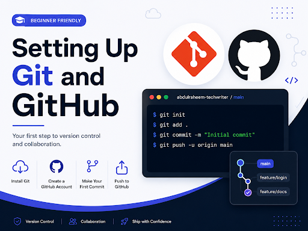
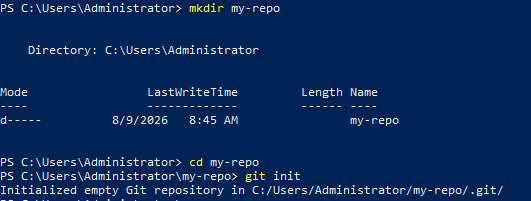
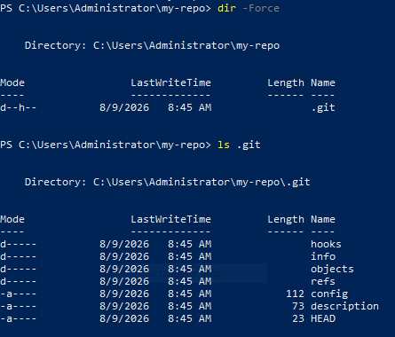
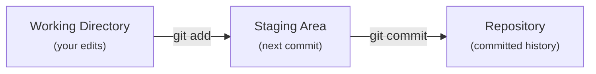
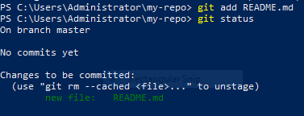
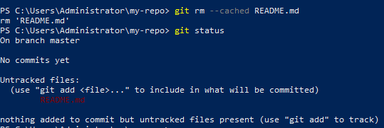
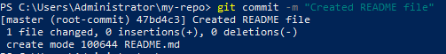

# **Setting Up Git and Repository for Beginners**

## **A Guide for Technical Writers and Documentation Engineers**

## **1\. Introduction**

Git has become an essential tool in modern documentation workflows. Many technical writing teams manage documentation alongside software projects, using the same tools software developers use.

Unlike traditional writing tools, **Git** allows you to keep a history of every change made to your documents. For technical writers, learning Git makes it easier to participate in Docs-as-Code workflows, contribute to open-source projects, and collaborate effectively with software developers and other technical writers.

This guide walks you through setting up Git from scratch and learning actions that you will use constantly in a docs-as-code workflow

### **Who this is for**

* Technical writers with little or no Git experience  
* Writers who can navigate folders in a terminal  
* Anyone moving from Word or Google Docs to Markdown-based documentation

### **What you will need**

* A computer running Windows, macOS, or Linux  
* A terminal application (PowerShell, Terminal, or Git Bash)  
* A plain-text editor such as Visual Studio Code  
* About 45 minutes to work through this section hands-on

### **By the end of this section, you will be able to:**

* Install Git  
* Configure your Git identity  
* Create a local repository  
* Understand what happens when you stage and commit changes

The tutorial is organized in small, hands-on sections so you can practice each step before moving to the next one.

## **2\. What Is Git?**

Git is a **version control system (VCS)**. It records changes to files over time so you can see **what changed, when it changed,** and **who changed it**.

If you have ever ended up with files named **guide-v1.md**, **guide-v2-final.md**, and **guide-v2-final-ACTUAL.md**, you have already experienced the problem Git is designed to solve.

### **Why version control matters**

* **Complete history:** Every saved change is recorded permanently, with a timestamp and an author.  
* **Safer collaboration:** Multiple people can work on the same files without overwriting each other’s work.  
* **Reliable recovery:** Instead of hoping you remember what the "old version" looked like, you can return to the exact state of a file (or an entire project) at any point in time.

### **What makes Git different?**

In older, centralized version control systems (like Subversion/SVN), there's a single master copy of the project's history living on a central server. Your computer holds only whatever version you currently have checked out. If that server goes down, nobody can view history, compare versions, or do much beyond edit their local files.

However, Git works differently. It is a **distributed** version control system. When you clone a repository, you get both the current files and the project’s full history on your own computer.

That means you can:

* View the full history  
* Compare versions  
* Commit changes  
* Work while offline

Later, you can sync your changes with a shared repository on GitHub, GitLab, or another hosting service.

### **Why this matters for technical writers**

This is the idea behind **docs-as-code**: documentation is written in plain text (usually Markdown), stored and tracked in Git, and reviewed using the same workflow developers use for code. It's why static site generators like Docusaurus and MkDocs pull their content directly from a Git repository, and why a documentation release can be tagged to match a specific software version.

### **A practical example**

Imagine two writers updating a product’s release notes ahead of launch:

* One documents a new feature.  
* The other fixes outdated screenshots.

Git records those changes as distinct commits. If the feature is removed before release, that specific commit can be reverted on its own, without affecting the screenshot updates made alongside it.

## **3\. Downloading Git**

Git is available for Windows, macOS, and Linux.

1. Visit the official Git website at [Git \- Install](https://git-scm.com/install/) 

Always download Git from the official website to ensure you get the latest and safest version.

2. Select your operating system to download the appropriate installer.  
3. Once downloaded, the installer file is typically saved in your **Downloads** folder.  
4. Confirm that the setup.exe file has been saved successfully.

## **4\. Installing Git**

:::info
The installation process depends on your operating system. This guide focuses on Windows. Installation on macOS and Linux follows similar steps and is covered in the official Git documentation.
:::

**For Windows**

1. Open the downloaded **.exe** installer.  
2. Accept the license agreement.  
3. Continue through the Setup Wizard using the default options.  
4. On the **Choose Default Editor** page, change the default editor to **Visual Studio Code**.  
5. On the **Adjust PATH Environment** page, make sure **"Git from the command line and also from third-party software"** is selected.  
6. Click **Install**.  
7. When installation finishes, click **Finish**.

Git is now installed on your computer.

## **5\. Verifying the Installation**

After installing Git, verify that it works correctly by:

1. Open the VS Code terminal or PowerShell (on Windows)  
2. Type: `git --version`  
3. Click **Enter**.

If Git is installed correctly, you will see a version number similar to:

`git version 2.55.0.windows.2.0`

The exact version may be different depending on when you install Git.

# **Your First Repository**

## **6\. What Is a Repository?**

A **repository**, often shortened to **repo**, is a project folder managed by Git. It stores your project's files together with their complete version history. A repository allows Git to track changes, record commits, and manage collaboration.

Repositories can exist in two places:

* **Local repository** – stored on your computer.  
* **Remote repository** – stored online on platforms such as GitHub.

In most projects, your local and remote repositories stay synchronized so you always have both a working copy and an online backup.

## **7\. Initializing a Repository**

To start using Git in a project, you need to turn the project folder into a Git repo. You do this with the `git init` command. For example, create a new folder and initialize it as follows:

1. Open PowerShell (on Windows)  
2. Run `mkdir my-repo`  
3. Run `cd my-repo`  
4. Run `git init`

Here, `mkdir` creates the `my-repo` folder, `cd` moves into it, and `git init` initializes Git in the current folder.

To confirm the initialization, check for this message:

`Initialized empty Git repository in .../my-repo/.git/`

You can also initialize an existing project. If you've already been writing documentation in a folder without Git, initialize the folder as follows:

1. Run `cd folder name`  
2. Run `git init`

Git doesn't alter or delete your existing files. It creates the internal data it needs to begin tracking changes from that point onward.

### **The `.git` folder**

When you run `git init`, Git creates a hidden `.git` folder inside the project. This is the repository's internal database: it contains the information Git uses to manage commits, branches, configuration, and other version-control data.

You normally won't need to work inside this folder, but knowing what it is helps explain how Git works:

* `objects/` — stores Git's objects, including commits and the data associated with file contents.  
* `refs/` — stores references used by branches and tags.  
* `HEAD` — identifies the branch or commit currently checked out.  
* `config` — contains configuration specific to this repository. A `git config` command run without `--global` can modify this file.

You should generally **not manually edit or delete files inside the `.git` folder**. Git manages this directory for you.

There is, however, one useful thing to know: deleting the .`git` folder removes the Git repository from that project. Your actual project files remain, but their Git history, branches, and repository configuration are removed.

**Try it yourself:**

After running `git init`, list the contents of the folder as follows:

1. Run `dir -Force`  
2. Run `ls .git`

Here, `dir -Force` checks the folder contents explicitly (including `.git` folder), and `ls .git` lists the contents of `.git` folder.

## **8\. Git Workflow**

Once a repository is initialized, Git follows a simple workflow:

These three areas serve different purposes:

1. **Working directory**: the files you're currently editing on your computer.  
2. **Staging area/Index**: the changes you've selected for your next commit.  
3. **Repository**: the Git database inside `.git` that contains your commits and other repository data.

The staging area is what gives Git much of its flexibility. You don't have to commit every change you've made at once.

For example, imagine you made changes to three Markdown files:

* `install-guide.md` — you fixed an incorrect command.  
* `faq.md` — you corrected a typo.  
* `changelog.md` — you're still working on it.

The first two changes may be ready to commit, while `changelog.md` is not. You can stage only the changes you want to include and leave the unfinished work in your working directory. This means a commit can represent **one logical change**, rather than simply being a record of everything you happened to edit that day.

:::info
A command you'll use frequently throughout this process is:

`git status`

It shows the current state of your working directory and staging area, including modified files, staged changes, and untracked files.
:::

**A practical example**

Suppose you're rewriting a troubleshooting page while also fixing a broken link in `README.md`. The troubleshooting page is still unfinished, but the README fix is complete.

You can stage and commit the README change without including the unfinished troubleshooting work. That is the purpose of the staging area: **it lets you decide what belongs in the next commit.**

## **9\. Staging Files**

After creating or editing a file, Git can detect the change, but it doesn't automatically include that change in your next commit.

For example, we will create a file (`README.md`) as the change and follow the workflow.

1. **Create file**

Run `New-Item README.md`

2. **Add text to file**

Run `“Welcome” > README.md`

3. **Check folder status**

Run `git status`

You will see something similiar to:

`Untracked files:`

      `(use "git add <file>..." to include in what will be committed)`

               `README.md`

The file has changed, but the change is still only in your working directory.

4. **Stage the change**

Run `git add README.md`

5. **Check folder status again**

Run `git status` again

The output should now show something similar to:

`Changes to be committed:`

      `(use "git rm --cached <file>..." to unstage)`

            `new file:   README.md`

The important difference is that `README.md` has moved from **"Untracked files"** to **"Changes to be committed."** That means the change is now in the staging area and will be included in the next commit.

* ### **Staging multiple files**

If you have several changes that belong in the same commit, you can stage them together by running:

`git add .`

The `.` means the current directory, so Git stages changes and untracked files under the current directory.

You can also stage multiple files explicitly by running:

`git add README.md install-guide.md`

This is useful when you want precise control over what goes into the commit.

* ### **Staging files by pattern**

You can use a pattern when you want to stage matching files in the current directory. For example:

`git add *.md`

This stages Markdown files matched by the shell pattern. For more complex projects, especially when files are nested in subdirectories, explicitly naming files can give you more predictable control.

* ### **Unstaging a file**

Suppose you staged `README.md` by mistake. You can remove it from the staging area without deleting your edits by running:

`git rm --cached README.md`

The file remains modified in your working directory; it is simply no longer selected for the next commit.

:::note
Stage `README.md` back for the next step.
:::

## **10\. Committing Files**

Once you've staged the changes you want to save, create a commit. Back to the example with the `README.md` file change:

Run `git commit -m "Create README file"`

Git will display output similar to:

`[master 47bd4c3] Create README file`

    `1 file changed, 0 insertions(+), 0 deletions(-)`

A commit records a snapshot of the changes you staged, along with metadata such as the author, timestamp, commit message, and a unique commit identifier (hash).

For example, `47bd4c3` is the abbreviated form of the commit's hash. You can use a commit's hash to identify and refer to that particular point in the project's history. Commits are also connected to earlier commits, creating the history that allows Git to show how a project has changed over time.

**Commits are local**

A commit is created on your computer. It is stored in the`.git` folder and is **not automatically uploaded anywhere**.

For example, committing a change does not send it to GitHub. Sharing commits with a remote repository requires a separate operation, such as `git push`, which is outside the scope of this introductory workflow.

## **Commit Best Practices**

A useful Git history should tell you what changed without making you reconstruct the story yourself. The easiest way to get there is to make each commit small, focused, and easy to understand.

* ### **Keep each commit focused**

A good rule is: **one commit should represent one logically separate change.**

Suppose you're fixing a broken code sample in `install-guide.md` and, while you're there, notice an unrelated typo in the introduction. Both changes are in the same file, but they have different purposes.

* ### **Keep related changes together**

Not every change needs its own commit. If several edits are part of the same task, keeping them together can make more sense.

For example, updating a documentation page, its code example, and the corresponding screenshot may reasonably belong in one commit if all three changes are required for the same documentation update.

The goal isn't to create as many commits as possible. The goal is to make each commit represent a change that makes sense on its own.

### **Other useful habits**

* **Don't commit secrets or unnecessary generated files.** API keys, passwords, build output, and similar files generally shouldn't be tracked. A `.gitignore` file can tell Git which files or directories to leave untracked.  
* **Keep formatting changes separate from content changes when practical.** If you reformat an entire document while also changing its content, reviewing the actual content changes becomes harder.  
* **Commit at meaningful points.** You don't need to commit every few minutes, but avoid waiting until an entire feature or documentation project has accumulated dozens of unrelated changes.  
* **Aim for a coherent state.** A commit should normally leave the project in a state that someone else can understand and work with, rather than capturing half-finished work simply because you want a checkpoint.
  