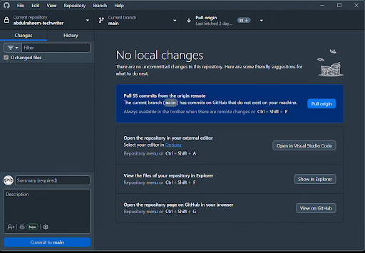

# **Setting Up Git and GitHub for Beginners**

## *A Guide for Technical Writers and Documentation Engineers*

## **1\. Introduction**

Git and GitHub have become essential tools in modern documentation workflows. Many technical writing teams manage documentation alongside software projects, using the same tools software developers use.

Unlike traditional writing tools, **Git** allows you to keep a history of every change made to your documents, while **GitHub** provides a platform for storing, sharing, and collaborating on those files.

For technical writers, learning Git and GitHub makes it easier to participate in Docs-as-Code workflows, contribute to open-source projects, and collaborate effectively with software developers and other technical writers.

This guide walks you through setting up Git and GitHub from scratch and assumes no prior experience with Git or GitHub.

# **Part 1: Understanding Git and GitHub**

## **2\. What is Git?**

Git is a **distributed version control system** that tracks changes made to files over time.

In simple terms, Git helps you record the history of a project. It allows you to see what changed, when it changed, and who made the change. If something goes wrong, you can return to an earlier version of your work.

### **How Git Works**

Git saves changes as **commits**.

A commit is a recorded snapshot of your project at a specific point in time. Each commit contains information about:

* What changes were made  
* Who made the changes  
* When the changes were made

## **3\. What Is GitHub?**

GitHub is an online platform that hosts Git repositories and provides tools for collaboration. While Git runs on your computer, GitHub stores copies of Git repositories online, allowing you to share your work and collaborate with others.

GitHub adds features that Git does not provide, including:

* **Pull requests** — a way to propose and review changes before adding them to a project.  
* **Issues** — tools for tracking tasks, bugs, and documentation requests.  
* **Discussions** — spaces for communicating with project contributors.

For technical writers, GitHub provides a central place to store documentation projects, review changes, and contribute to team workflows.

## **4\. Git versus GitHub**

Although Git and GitHub work together, they are different tools.

| Git | Github |
| ----- | ----- |
| A version control system | A platform for hosting Git repositories |
| Runs on your computer | Runs on the web |
| Tracks changes to files | Stores and shares Git repositories |
| Works without internet | Requires internet for syncing |
| Does not include collaboration features | Includes pull requests, issues, and discussions |

### **When to Use Git**

Use Git whenever you need to track changes to files on your computer.

Examples:

* Creating document versions  
* Reviewing previous changes  
* Managing documentation updates

### **When to Use GitHub**

Use GitHub when you want to:

* Back up your work online  
* Share projects with others  
* Collaborate with a team  
* Contribute to open-source projects

## **5\. Why Technical Writers Use Git and GitHub**

Git and GitHub provide several benefits that improve the documentation process.

* ### **Version Control**

Git records every change made to documentation files. This means you can review previous versions and restore older content when needed.

* ### **Collaboration**

Multiple writers and contributors can work on the same documentation project without accidentally overwriting each other's changes.

* ### **Documentation Workflows**

Git allows documentation teams to follow structured workflows for writing, reviewing, and publishing content.

For example:

1. A writer creates a documentation update.  
2. The changes are saved in Git.  
3. A reviewer checks the changes.  
4. The approved update is added to the main documentation.

* ### **Docs-as-Code**

Docs-as-Code is an approach in which documentation is created and managed with the same tools and processes used for software development.

Technical writers using Docs-as-Code often work with:

* Markdown files  
* Git repositories  
* Code editors like VS Code  
* Documentation platforms

* ### **Change Tracking**

Git can show exactly what changed between versions of a document. This makes reviewing edits easier, especially for large documentation projects.

* ### **Documentation Reviews**

GitHub pull requests allow reviewers to comment on specific lines of documentation before changes are published.

# **Part 2: Installing Git**

## **6\. Downloading Git**

Git is available for Windows, macOS, and Linux.

1. Visit the official Git website at [Git \- Install](https://git-scm.com/install/) 

:::note
Always download Git from the official website to ensure you get the latest and safest version.
:::

2. Select your operating system to download the appropriate installer.  
3. Once downloaded, the installer file is typically saved in your **Downloads** folder.  
4. Confirm that the setup.exe file has been saved successfully.

## **7\. Installing Git**

:::info
The installation process depends on your operating system. This guide focuses on Windows. Installation on macOS and Linux follows similar steps and is covered in the official Git documentation.
:::

**For Windows**

1. Open the downloaded **.exe** installer.  
2. Accept the license agreement.  
3. Continue through the Setup Wizard using the default options.  
4. On the **Choose Default Editor** page, change the default editor to **Visual Studio Code**.  
5. On the **Adjust PATH Environment** page, make sure **"Git from the command line and also from third-party software"** is selected.  
6. Click **Install**.  
7. When installation finishes, click **Finish**.

Git is now installed on your computer.

## **8\. Verifying the Installation**

After installing Git, verify that it works correctly by:

1. Open the VS Code terminal or Command Prompt (on Windows)  
2. Type: `git --version`  
3. Click **Enter**.

If Git is installed correctly, you will see a version number similar to:

`git version 2.55.0.windows.2.0`

:::note
The exact version may be different depending on when you install Git.
:::

# **Part 3: Configuring Git**

## **9\. Why Configuration Matters**

Every commit you create includes your username and email address. Git uses these details to identify who creates every commit.

This setup ensures that:

* Your changes are properly credited.  
* Your commits can be linked to your GitHub account.  
* Other contributors know who made specific updates.

You only need to configure Git once on your computer.

## **10\. Setting Your Username**

1. Open your terminal  
2. Run: `git config --global user.name "Your Name"`  
3. Replace `"Your Name"` with the username you want to appear in your Git commits.

Example: `git config --global user.name "FavourAdebayo"`

## **11\. Setting Your Email**

1. Open your terminal  
2. Run: `git config --global user.email "your@email.com"`  
3. Replace `"your@email.com"` with the email address associated with your GitHub account. This helps GitHub connect your commits to your profile.

Example: `git config --global user.email "favouradebayo@gmail.com"`

## **12\. Checking Your Configuration**

To view your Git configuration, run:

`git config --global user.name`

And run:

`git config --global user.email`

You should see your configured username and email address, respectively.

# **Part 4: Creating a GitHub Account**

## **13\. Signing Up on GitHub**

Before you can store repositories online or collaborate with others, you'll need a GitHub account.

To create one:

1. Visit [Sign up for GitHub](https://github.com/signup).  
2. Enter your email address.  
3. Create a secure password.  
4. Choose a unique username.  
5. Complete the verification process.  
6. Follow the prompts to finish creating your account.

:::tip
Choose a professional username if you plan to use GitHub for technical writing or software projects, as it will appear on your public profile and repositories.
:::

## **14\. Exploring the GitHub Dashboard**

Once you've signed in, you'll be directed to the GitHub dashboard. The dashboard is your starting point for creating repositories, managing projects, and collaborating with others.

Some of the areas you'll use most often include:

* ### **Home**

The Home page displays updates from repositories and people you follow.

* ### **Repositories**

Repositories contain your projects and documentation. You'll create your first repository later in this guide.

* ### **Profile**

Your profile displays information about you, your repositories, contributions, and activity on GitHub.

* ### **Organizations**

Organizations are shared workspaces used by companies, open-source communities, or teams to manage repositories together.

* ### **Settings**

Settings allow you to manage your account, security, notifications, appearance, and authentication methods.

Take a few minutes to explore these sections and become familiar with the interface.

## **15\. Personalizing Your Profile**

Although optional, completing your profile helps other contributors recognize you.

To edit your profile:

1. Click your profile picture in the upper-right corner.  
2. Select **Profile**.  
3. Click **Edit profile**.

You can customize several parts of your profile.

* ### **Profile Picture**

Upload a clear profile picture or avatar. This image appears beside your commits, pull requests, and comments.

* ### **Name**

Add your full name if you'd like it displayed on your profile instead of only your username.

* ### **Bio**

Your bio is a short description of yourself.

For example:

> *Technical Writer | Docs-as-Code | Open Source Contributor*

Keep it brief and relevant to your interests or profession.

* ### **Location (Optional)**

You may choose to add your location if you'd like others to know where you're based.

* ### **Website (Optional)**

You can also add links to your personal website, portfolio, or LinkedIn profile.

* ### **Profile README (Optional)**

GitHub allows you to create a special profile README.

To create one:

1. Click the **\+** icon in the upper-right corner.  
2. Select **New repository**.  
3. Name the repository the same as your GitHub username.  
4. Enable **Add README**.  
5. Create the repository.

The contents of this README file will appear at the top of your GitHub profile, allowing you to introduce yourself and showcase your work.

## **16\. Authentication with GitHub**

Authentication verifies your identity when Git communicates with GitHub. Without it, GitHub won't allow you to perform actions such as pushing changes or accessing private repositories.

GitHub requires users to authenticate before performing actions that modify repositories. This helps protect your account and your projects.

### **Authentication Methods**

Git supports several authentication methods. They include:

#### **1\. Git Credential Manager (Recommended for Beginners)**

Git Credential Manager (GCM) is included with recent versions of Git for Windows. When you perform an action that requires authentication, Git opens your web browser and asks you to sign in to GitHub.

After you authorize Git, your credentials are securely stored, so you won't need to sign in every time you use Git. For most beginners, this is the easiest and recommended authentication method.

#### **2\. Personal Access Tokens (PATs)**

If Git Credential Manager isn't available, GitHub may ask you to authenticate using a Personal Access Token instead of your account password.

A Personal Access Token is a secure code generated from your GitHub account that replaces your password during Git operations.

#### **3\. Secure Shell (SSH) Keys**

SSH authentication uses a pair of cryptographic keys to securely connect your computer to GitHub. Once configured, you can interact with GitHub without entering credentials each time.

Developers and frequent Git users commonly use Secure Shell, but it requires a few additional setup steps.

# **Part 5: Your First Repository**

## **17\. What Is a Repository?**

A **repository**, often shortened to **repo**, is a project folder managed by Git. It stores your project's files together with their complete version history. A repository allows Git to track changes, record commits, and manage collaboration.

Repositories can exist in two places:

* **Local repository** – stored on your computer.  
* **Remote repository** – stored online on platforms such as GitHub.

In most projects, your local and remote repositories stay synchronized so you always have both a working copy and an online backup.

## **18\. Creating a Repository on GitHub**

Now that you have a GitHub account, you can create your first repository.

To create one:

1. Click the **\+** icon in the upper-right corner.  
2. Select **New repository**.

You'll be asked to complete a few details.

* ### **Repository Name**

Choose a short, descriptive name.

For example:

* technical-writing-guide  
* markdown-practice  
* docs-project

Avoid spaces. Use hyphens (`-`) if your repository name contains multiple words.

* ### **Description**

Optionally, add a brief description explaining what the repository contains.

* ### **Visibility (Public or Private)**

**Public**

Anyone can view the repository. This is ideal for open-source projects, portfolios, and documentation you want to share.

**Private**

Only you and collaborators you invite can access the repository. This is useful for personal work or documentation that isn't ready to be shared publicly.

* ### **Add README**

Enable **Add README**.

A `README.md` file introduces your project and is usually the first file visitors read. For beginners, creating the repository with a README is recommended.

* ### **Add .gitignore**

A `.gitignore` file tells Git which files or folders should not be tracked.

Examples include:

* temporary files  
* build files  
* operating system files

For a simple documentation project, you can leave this option as **No .gitignore**

* ### **Add license**

A license explains how others may use your project.

If you're unsure which license to choose, you can leave this option as **No license** or select a commonly used permissive license such as the **MIT License**.

After completing these options, click **Create repository**. Your first GitHub repository is now ready.

## **19\. Repository Structure**

A newly created repository with a README typically includes:

### **1\. README.md**

GitHub automatically displays this file on the repository's home page.

It usually contains:

* Project overview  
* Installation instructions  
* Usage information  
* Contribution guidelines

### **2\. .gitignore (Optional)**

This file lists files and folders that Git should ignore. Ignoring unnecessary files keeps repositories clean and avoids tracking temporary or generated files.

### **3\. LICENSE (Optional)**

The LICENSE file explains how others are permitted to use your project.

### **4\. Project Files**

These are the actual files that make up your documentation project.

For example:

* Markdown files  
* Images  
* Configuration files  
* Documentation folders

### **5\. The .git Folder**

When a repository is cloned to your computer, Git automatically creates a hidden `.git` folder. This folder stores your repository's version history and configuration. Although it's essential for Git, you should never edit its contents directly.

## **20\. Cloning a Repository Using HTTPS**

Cloning creates a complete copy of a remote repository on your computer. Unlike downloading a ZIP file, cloning using HTTPS includes the repository's version history and connects your local copy to the GitHub repository.

To clone a repository:

1. Open the repository on GitHub.  
2. Click the green **Code** button.  
3. Ensure **HTTPS** is selected.  
4. Copy the repository URL.

Next:

1. Open VS Code  
2. Navigate to the folder where you'd like to save the repository.  
3. Open the VS Code terminal  
4. Run: `git clone https://github.com/username/repository-name.git`  
5. Replace the URL with the one you copied from GitHub.

For example: `git clone https://github.com/FavourAdebayo/my-project.git`

6. Press **Enter**.

Git downloads the repository into the new folder on your personal computer.

# **Troubleshooting**

If you encounter any issues while setting up Git or GitHub, try the solutions below.

## **1\. Git command is not recognized**

### **Possible causes**

* Git is not installed.  
* Git was not added to your system PATH during installation.

### **Solution**

* Verify that Git is installed on your computer by running `git --version`  
* Reinstall Git and ensure the option to add Git to your system PATH is selected.  
* Restart your terminal or computer after installation.

## **2\. Git version isn't displayed**

### **Possible causes**

* Git installation was interrupted.  
* The terminal cannot locate Git.

### **Solution**

Run: `git --version`

If no version number is displayed, reinstall Git using the latest installer from the official Git website.

## **3\. I can't create a GitHub account**

### **Possible causes**

* The username is already taken.  
* The email address is already associated with another account.  
* The password is weak

**Solution**

* Choose a different username.  
* Use another email address if necessary.  
* Use a strong password that contains uppercase and lowercase letters, numbers, and symbols.

## **5\. I can't find my repository**

### **Solution**

* Open the **Repositories** tab on your GitHub profile.  
* Confirm you're signed in to the correct GitHub account.  
* Refresh the page if you recently created the repository.

## **6\. The repository won't clone**

### **Possible causes**

* The repository URL is incorrect.  
* The repository is private, and you don't have access.  
* Your internet connection is unavailable.

### **Solution**

* Copy the repository URL again using the **Code** button on GitHub.  
* Make sure **HTTPS** is selected  
* Ensure you have permission to access the repository.  
* Check your internet connection and try again.

## **7\. I don't know whether to use HTTPS or SSH**

### **Solution**

Choose the method that best fits your workflow.

* **HTTPS** is easier to start with and works well for beginners.  
* **SSH** requires additional setup but provides a smoother experience for regular Git users because it doesn't repeatedly ask for credentials.

You can switch from HTTPS to SSH later if your workflow changes.

## **8\. I accidentally closed the terminal**

### **Solution**

Reopen the terminal.

In VS Code, select **Terminal \> New Terminal**.

Your repository files remain unchanged, and you can continue where you left off.

# **Conclusion**

With the steps in this guide completed, you have successfully installed and configured Git, created a GitHub account, and cloned your first repository. You now have the foundation needed to begin using Git and GitHub in your technical writing workflow.