# **Understanding Static Site Generators & Setting Up Docusaurus for Beginners**

## *A Guide for Technical Writers and Documentation Engineers*

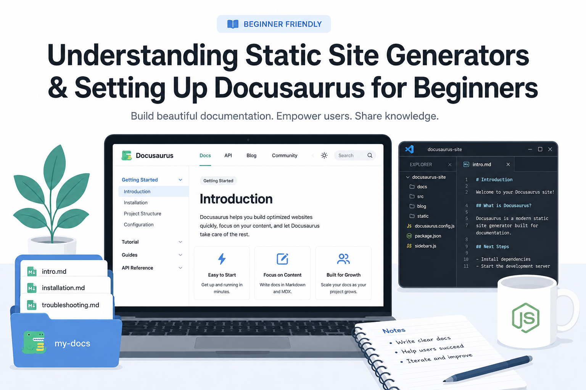

## **1\. Introduction**

Static site generators (SSGs) have become a common and essential tool in modern documentation workflows. Many technical writing and documentation engineering teams use them to build product documentation, developer-facing documentation (e.g., API references), internal knowledge bases and more.

Unlike traditional website builders (e.g., Wix, Squarespace), a static site generator takes content written in plain text — usually Markdown/MDX — and converts it into a complete, functional website. This kind of approach works particularly well with **Docs-as-code** workflows because the written content can be version-controlled with Git, reviewed through pull requests, and published automatically.

There are several static site generators used for documentation, including **Docusaurus**, **MkDocs**, **Hugo**, and **Jekyll**. This guide walks you through the basic environment needed for documentation-focused static site generators and then uses Docusaurus as the hands-on example.

### **By the end of this section, you will be able to:**

* Install and verify Node.js  
* Install a Docusaurus demo project  
* Understand the key project files and folders  
* Preview the Docusaurus site locally

## **2\. What Is a Static Site Generator?**

A static site generator (SSG) is a tool that converts source files, such as Markdown, HTML templates, and configuration files, into a set of ready-to-serve web pages.

Instead of editing pages directly on a website (e.g., **CMS\[Content Management System\]-based sites** like Sanity) you edit the source files on your local machine and let the generator build the website for you.

### **Common documentation-focused static site generators**

| Tool | Common use |
| :---- | :---- |
| Docusaurus | Developer and product documentation |
| MkDocs | Technical and internal documentation |
| Hugo | Large documentation and content sites |
| Jekyll | Github Pages and general static sites |

In this guide, we will focus on Docusaurus because it is one of the most widely used documentation-focused static site generators and provides a beginner-friendly starting point.

## **3\. What Is Node.js?**

Node.js is a tool that allows JavaScript programs to run outside a web browser, directly on a computer/server.

Normally, JavaScript only runs inside a browser tab like Chrome, and Firefox. But Node.js uses the same engine a browser uses internally (e.g., **V8 — Chrome's engine**) and lets you run the JavaScript code directly from your computer’s terminal.

Docusaurus is built with JavaScript, so it requires Node.js in order to run.

### **Why technical writers & documentation engineers need it**

Node.js is essential because it serves as the engine that powers the documentation site. It runs the commands that install the demo project, start the local preview server, and build the final website.

For example, when you run:

`npm run start`

Node.js is responsible for starting the local Docusaurus website on your computer. This is why installing Node.js is the first technical step in almost every Docusaurus tutorial.

## **4\. What Is Docusaurus?**

Docusaurus is a static site generator (SSG) designed specifically for documentation websites. It takes content written in plain text files and generates a website that readers can access through a browser.

Instead of writing and formatting every documentation page directly in a website editor, you write your content as files in the project folder. Docusaurus then handles the work of turning those files into a structured documentation website.

For example, you create a file called:

`about.md`

and write:

```markdown
# About Me

Technical writer with a straightforward approach: take complex technical information and turn it into content that's easy to understand and act on.
```

Docusaurus takes this Markdown content and renders it as a formatted web page. You do not need to manually write the HTML for the heading or paragraph. Docusaurus handles that part when it builds the site.

### **Why technical writers & documentation engineers use Docusaurus**

- **Plain-text content:** Documentation can be written in Markdown or MDX rather than a proprietary editor.  
- **Version control:** Documentation can be stored in Git, allowing you to track changes and restore previous versions.  
- **Collaboration:** Writers, developers, and other contributors can work on documentation in the same repository.  
- **Review:** Documentation changes can go through pull requests before they are published.  
- **Automation:** The site can be built and published automatically as part of a documentation or software workflow.  
- **Documentation features:** Docusaurus provides tools for organising documentation into pages, categories, sidebars, and navigation.

## **5\. Downloading Node.js**

Node.js is available for Windows, macOS, and Linux.

1. Visit the official Node.js website at [Download Node Js](https://nodejs.org/en/download) 

:::note
Always download Node.js from the official website to ensure you receive a supported and secure release.
:::

2. Choose the most recent **LTS (Long-Term Support)** version. It’s stable and recommended.

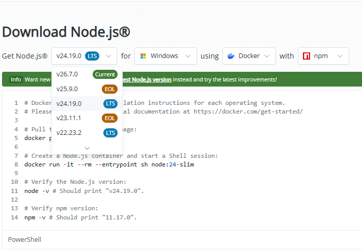

3. Select your operating system from the dropdown menu.

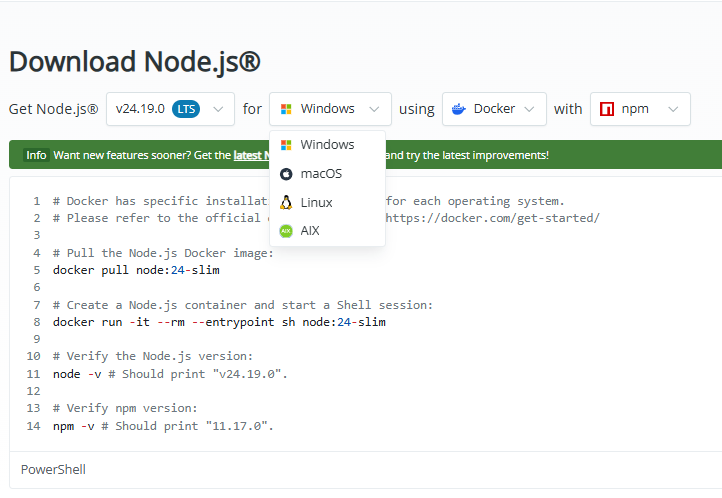

4. For Windows, download the **.msi** installer file.

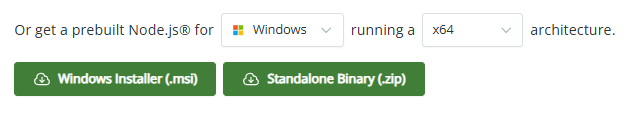

5. Once downloaded, the installer file is typically saved in your **Downloads** folder.  
6. Confirm that the **.msi** file has been saved successfully.

## **6\. Installing Node.js**

The installation process depends on your operating system. This guide focuses on Windows.

**For Windows**

1. Double-click the downloaded **.msi** installer file.  
2. Accept the license agreement.  
3. Continue through the Setup Wizard using the default options.  
4. On the **Custom Setup** page, leave everything checked (**npm package manager** should be included by default).  
5. Click **Install** and wait for installation.  
6. When installation finishes, click **Finish**.

:::note
If the installer offers options related to **additional tools** or **dependencies**, leave them **unchecked** and the **default selections checked,** unless you have a specific reason to change them.
:::

After installation, close any terminal windows that were already open and open a new terminal. This ensures the new Node.js commands are available.

## **7\. Verifying the Installation**

After installing Node.js, verify that both Node.js and npm are working correctly.

### **To check Node.js**

1. Open PowerShell (on Windows) or any terminal  
2. Type `node -v`  
3. Click **Enter**

If Node.js is installed correctly, the output should be something similar to:

`v24.18.0`

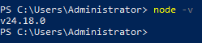

Your version may be different, depending on when you install Node.js. But it must be v20 or higher for current versions of Docusaurus.

### **To check npm**

1. Open PowerShell (on Windows) or any terminal  
2. Type `npm -v`  
3. Click **Enter**

If npm is installed correctly, the output should be something similar to:

`11.16.0`

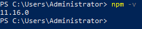

### **If the commands fail**

1. Reopen the terminal and run the commands again.  
2. Restart the computer if necessary.  
3. Reinstall Node.js and follow the installation process carefully.

Verify that both commands return version numbers successfully before continuing.

## **8\. Creating a Docusaurus Project**

Docusaurus provides an official starter template that creates a complete working documentation site for you. This is the easiest and recommended way to begin.

### **Create a folder for the project**

You need an ordinary folder on your computer in which to create the project.

For example, on your computer, create a **docusaurus-projects** folder in the **Desktop** system folder.

### **Move into that folder**

After creating the docusaurus-project folder, follow these steps.

1. Open PowerShell or any terminal  
2. Type `cd Desktop/docusaurus-projects`  
3. Click **Enter**

The `cd` command means **change directory**. Running it changes the file path, and moves you into the created docusaurus-projects folder.

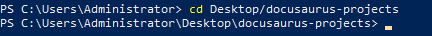

### **Install the Docusaurus project**

1. Type `npx create-docusaurus@latest my-website classic`  
2. Click **Enter**  
3. Select **JavaScript** as the language to use

**What the command means**

| Part | Meaning/Function |
| :---- | :---- |
| `npx` | Runs a package from the npm ecosystem without needing to  install that package globally. |
| `create-docusaurus@latest` | Uses Docusaurus’s project-generation tool and asks for the latest available version. |
| `my-website` | Name of the folder containing the new site. |
| `classic` | Selects the classic starter template containing standard documentation, blog, custom pages and styling. |

### **Let the installation finish**

After you initiate the process, npm downloads the packages needed by the project. A lot of terminal output will be displayed (npm recording the packages as it’s downloading and installing).

Make sure the terminal stays open throughout the process. When the process finishes, you should see a success message and any suggested next steps.

### **Verify the installation**

After creating the docusaurus-project folder, follow these steps.

1. Open the File Explorer  
2. Navigate to **Desktop \> docusaurus-projects**  
3. If the installation is successful, a new **my-website** folder should appear

Your Docusaurus site now lives inside the **my-website** folder with file path as follows:

`Desktop > docusaurus-projects > my-website`

## **9\. Opening the Project in VS Code**

Creating the project and opening it in the editor are two separate steps.

### **Open the project folder**

1. Open VS Code  
2. Select File \> Open Folder

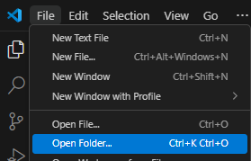

3. Locate the **my-website** folder  
4. Select it and click **Enter**

The File Explorer should now show the project folder and contents. You should see files and folders similar to:

```text
my-website/
├── .docusaurus/
├── blog/                    # Blog/Articles
├── docs/                    # Documentation
├── node_modules/
├── src/                     # Source code
├── static/                  # Static assets e.g, Images
├── .gitignore
├── .stackblitzrc
├── docusaurus.config.js
├── package-lock.json
├── package.json
├── README.md
├── sandbox.config.json
└── sidebar.js
```

## **10\. Understanding the Project Structure**

A new Docusaurus project contains several files and folders, but as a beginner technical writer and documentation engineer, you only need to understand a few of them initially. Starting with those that matter to documentation work.

* ### **The `docs` folder**

This is where your documentation pages live. For example:

```text
docs/
├── intro.md
├── installation.md
└── troubleshooting.md
```

As a technical writer and documentation engineer, this will become the folder you spend most time in.

* ### **The `blog` folder**

This contains blog posts.

* ### **The `static` folder**

This is where static assets such as images can be stored. For example:

```text
static/
├── img/
├── image1.png
└── favicon.ico
```

These files can then be referenced from your documentation.

* ### **The `src` folder**

This is where the site’s custom **source code** lives. As a beginner, you have little reason to edit it during the first stages of your project. However, it becomes relevant when you start customizing your site for interactivity etc.

* ### **The `sidebars.js` file**

This file controls the site’s sidebar configuration. Depending on how the site is configured, documents can be listed explicitly or generated from the filesystem structure. Docusaurus also supports **autogenerated sidebars** in which **folders become categories** and **files become documentation links**.

* ### **The `docusaurus.config.js` file**

This is the site’s main configuration file. It contains settings such as the site’s title, URL, navigation bar, theme configuration, and other options.

:::tip
Learn the purpose and codebase of a file before editing it.
:::

## **11\. Running the Docusaurus Site Locally**

A development server lets you preview the documentation on your own computer. Preview the site as follows:

### **Move into the project folder**

1. Open PowerShell or any terminal  
2. Make sure the file path in the terminal ends with **\\my-website\>** (that means the terminal is inside my-website folder)  
3. If it does not, run `cd my-website`

### **Start the development server**

Run `npm run start`

This starts Docusaurus’s local development server. Docusaurus uses this server while you are working on the site so that you can preview changes locally.

As the development starts, the terminal displays information about the server. By default, Docusaurus uses:

`http://localhost:3000`

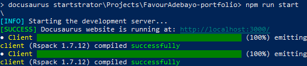

The browser should open automatically. However, if it doesn’t, open your browser and enter the address yourself.

Spend a minute clicking around the new Docusaurus site. Make sure the server keeps running, as you’ll need to preview changes made to your projects files and folders.

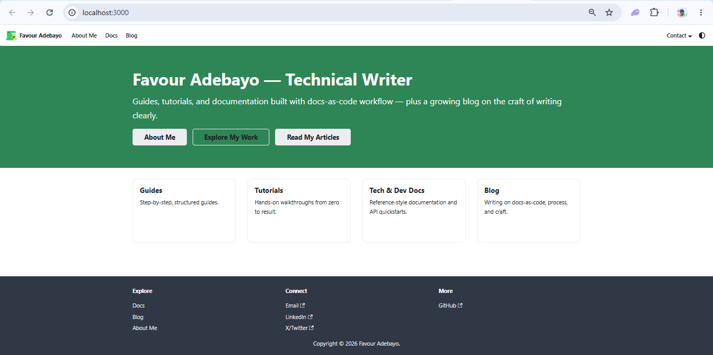

:::note
While the server is running, you cannot run a separate command unless you stop the server with **Ctrl \+ C** command. Open a second terminal (e.g., VS Code terminal) when you need to run another command.
:::

## **12\. Creating Your First Documentation Page**

Now you will create your own page instead of editing the example content.

### **Create a new file**

1. Open the project folder (refer to section 9\)  
2. In the File Explorer, find **docs** folder  
3. Click the dropdown icon to expand it

You should see an `intro.mdx` file.

4. Right-click on **docs**  
5. Select New File  
6. Name the file `about.md`

The folder structure should now look roughly like:

```text
docs/
├── intro.mdx
└── about.md
```

### **Add your content**

Open `about.md` and enter:

```markdown
# About Me

I'm a technical writer with a background in ..., currently ... at ... My approach is straightforward: take complex technical information and turn it into content that's easy to understand and act on.

## Technical Writing

Technical writing is the core of what I do. I focus on making information findable and usable — whether that's a step-by-step guide, a tool's documentation, or a full docs site.

I have a growing focus on **docs-as-code**: writing documentation in Markdown, managing it with Git, and using GitHub Actions to automate the build and deployment of documentation sites with Docusaurus. It's a workflow that treats documentation the way engineers treat software — versioned, reviewed, and shipped.

## Tools I Work With

- Markdown
- Git & GitHub
- Docusaurus

## Let's Work Together

I'm always looking to contribute to teams and projects where communication needs to be precise and accessible. Feel free to reach out through any of the links in the navbar above.
```

:::note
The above is written in Markdown.
:::

### **Save the file**

Use the shortcut command **Ctrl \+ S** to save the file.

### **Open the page in your browser**

With the development server still running,

Open [http://localhost:3000/docs/about](http://localhost:3000/docs/about) in your browser

You should see the content rendered as a Docusaurus documentation page. The Markdown syntax in the written content is also converted into formatted headings, paragraphs and lists.  

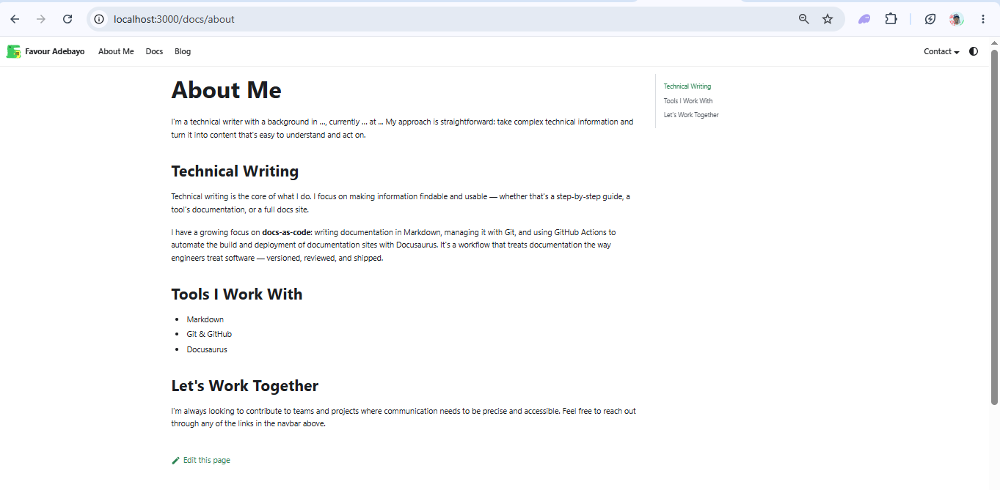
