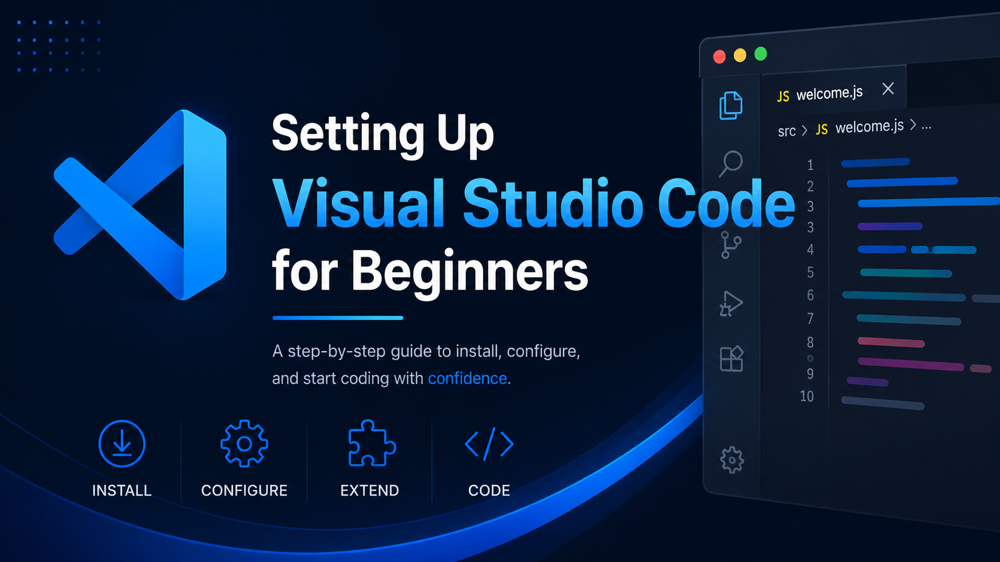
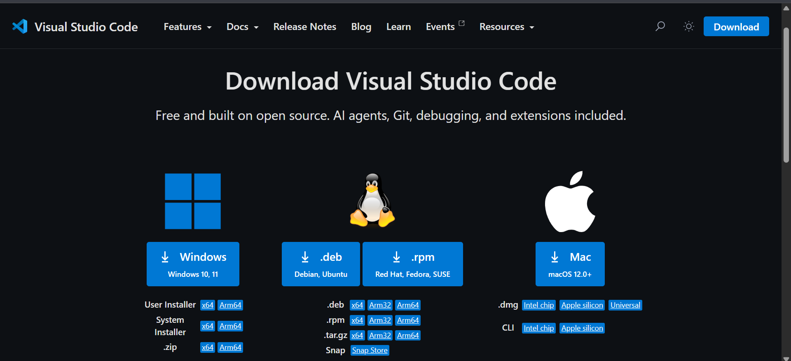
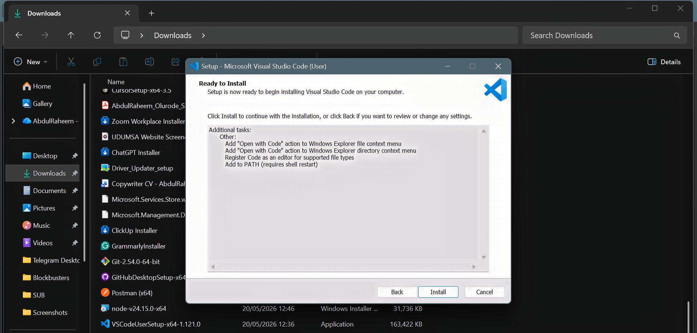
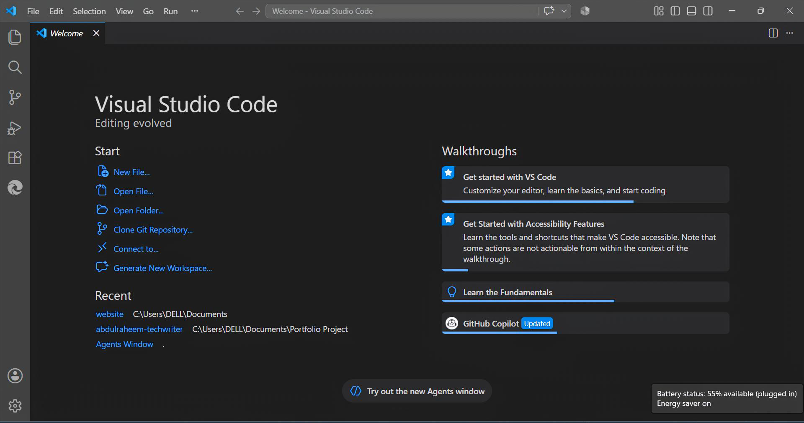
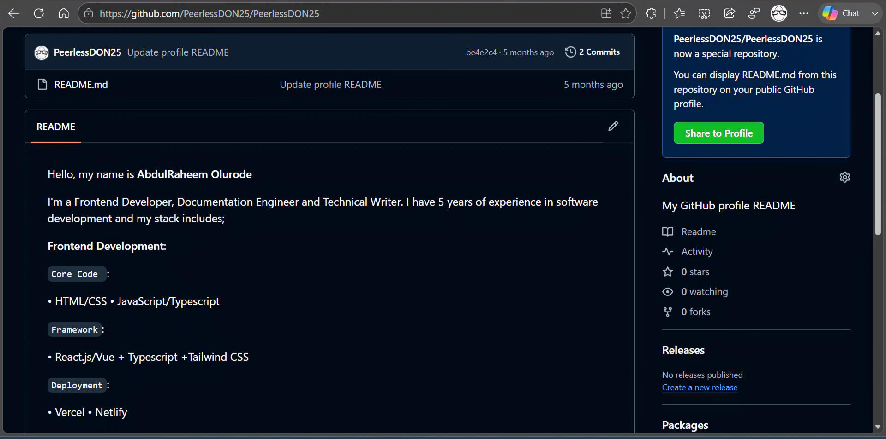
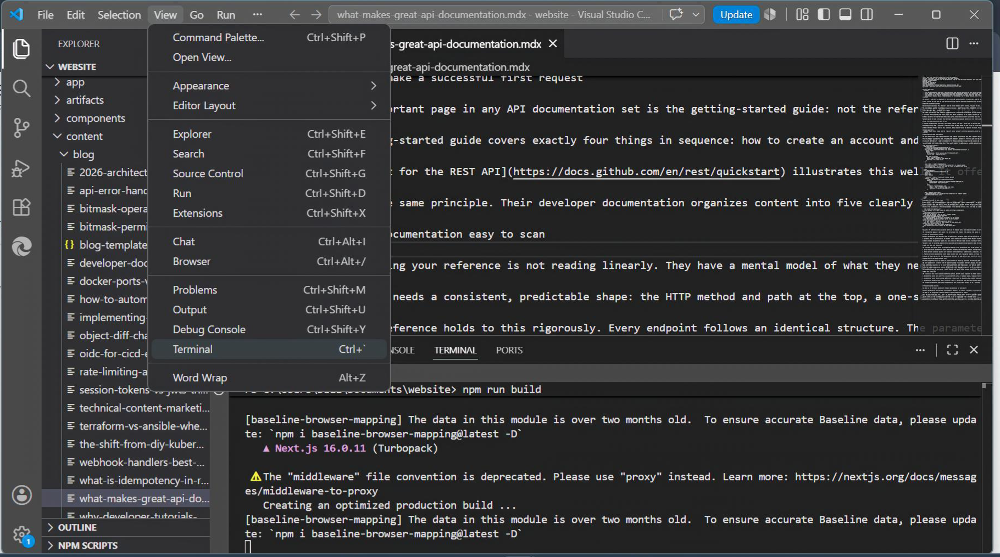
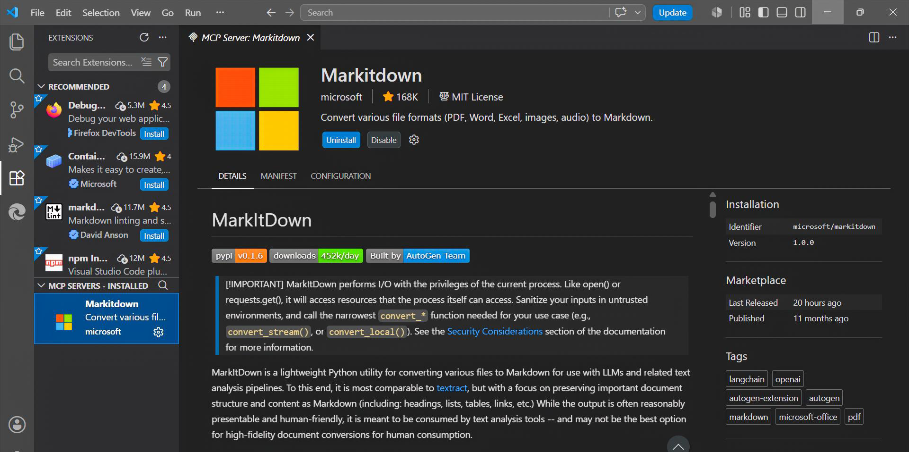

# **Setting Up Visual Studio Code for Beginners**

## *A Guide for Technical Writers and Documentation Engineers*



## **1\. Introduction**

Visual Studio Code (VS Code) is a free, lightweight code editor developed by Microsoft. Although it was originally designed for software development, it has become one of the most popular tools for technical writing because it simplifies creating, editing, organizing, and managing documentation.

Unlike traditional word processors, VS Code lets you write in plain text using Markdown, preview your work as you write, organize documentation into projects, and collaborate with others using version control tools like Git.

This guide walks you through downloading, installing, and setting up VS Code for technical writing. By the end, you'll have a clean, beginner-friendly workspace ready for writing documentation.

:::note
This guide assumes no prior experience with VS Code.
:::

# **Part 1: Understanding VS Code**

## **2\. What Is an IDE and a Code Editor?**

Before installing VS Code, it's helpful to understand what kind of application it is.

A **text editor** is a simple program for writing plain text files. Examples include Notepad on Windows and TextEdit on macOS.

A **code editor** builds on a text editor by adding features that make writing structured text easier, such as syntax highlighting, file organization, search tools, and extensions. VS Code is a code editor.

An **Integrated Development Environment (IDE)** is a more comprehensive application that combines a code editor with additional tools for software development, such as debugging, testing, and project management.

Although VS Code is officially a code editor, its extensive features and extensions allow it to function much like an IDE when needed. As a technical writer, you don't need programming experience to benefit from VS Code. Many of its features are designed to improve the writing and management of documentation.

## **3\. Why VS Code Is Great for Technical Writers**

VS Code offers several features that make documentation easier to write and maintain. Some of its most significant features for technical writers include the following:

- ### **Markdown support**

Write documentation in Markdown and preview it instantly without leaving the editor.

- ### **Built-in file management**

Keep documentation, images, and related files organized in one workspace.

- ### **Extensions**

Customize VS Code by installing extensions for spell checking, Markdown editing, Git integration, and more.

- ### **Integrated terminal**

Run Git commands and other tools directly inside VS Code without opening another application.

- ### **Search and Replace**

Quickly find and update text across one file or an entire documentation project.

- ### **Version control integration**

VS Code works seamlessly with Git, making it easy to track changes and collaborate with others.

- ### **Cross-platform support**

The same experience is available on Windows, macOS, and Linux.

# **Part 2: Installing VS Code**



## **4\. Downloading VS Code**

1. Visit the official Visual Studio Code website at [**Download Visual Studio Code \- Free AI Code Editor for Mac, Linux, Windows**](https://code.visualstudio.com/download)**.**

:::tip
Always download VS Code from the official website to ensure you receive the latest and safest version.
:::

2. The website automatically detects your operating system and recommends the appropriate installer.  
3.  Verify that the suggested download matches your operating system before starting the download.  
4. Once downloaded, the installer file is typically saved in your **Downloads** folder.  
5. Confirm that the **setup.exe** file has been saved successfully.

:::note
This guide focuses on Windows. The setup file for Linux and Mac can be downloaded from the official Visual Studio Code website as well.
:::



## **5\. Installing VS Code**

### **For Windows**

1. Open the downloaded **.exe** installer.  
2. Accept the license agreement.  
3. Continue through the Setup Wizard using the default options.  
4. On the **Select Additional Tasks** page, leave **Add to PATH** selected. This allows you to open VS Code from the command line using the `code` command.  
5. Click **Install**.  
6. When installation finishes, click **Finish** to launch VS Code.

:::note
This guide focuses on Windows. Installation on macOS and Linux follows similar steps and is covered in the official VS Code documentation.
:::



# **Part 3: First Launch**

## **6\. Touring the VS Code Interface**

When VS Code opens for the first time, you'll see several areas that make up the workspace.

* ### **Activity Bar**

Located on the far left, the Activity Bar contains shortcuts (icons) to the Explorer, Search, Source Control, Run and Debug, and Extensions views.

* ### **Primary Side Bar**

Displays the content of whichever view you've selected, such as your project files in the Explorer.

* ### **Editor**

The largest section of the window where you create and edit files.

* ### **Panel**

Located at the bottom of the window, the Panel contains the integrated Terminal, Output, Problems, and Debug Console.

* ### **Status Bar**

The bar at the bottom displays useful information such as the file language mode, line number, and notifications.

* ### **Secondary Side Bar**

An optional sidebar used by certain views and extensions, such as Chat with Copilot AI.

:::tip
Take a few moments to click around these areas. Becoming familiar with the interface will make navigating VS Code much easier.
:::

# **Part 4: Your First Workspace**

## **7\. Creating Your First Workspace**

A **workspace** is the folder that contains all the files for your project.

Instead of opening individual files, VS Code encourages you to open an entire project folder. This helps keep everything related to your documentation in one place.

The folder can also be accessible in your file explorer after creation. This means your project can be saved locally even if created inside VS Code.

To create your workspace:

1. Create a new folder for your documentation project.  
2. In VS Code, select **File \> Open Folder**.  
3. Choose the folder you created.  
4. If prompted about **Workspace Trust**, click **Yes, I trust the authors** for folders you created or trust.

Your folder will now appear in the Explorer as your workspace.



## **8\. Creating Your First README File**

Most documentation projects begin with a **README.md** file.

A **README** **file** is usually the first document people read when opening a project. It introduces the project and provides important information such as installation instructions, usage, and contribution guidelines. As technical writers, it is essential to know how to create a README file, especially when working on repositories.

To create one:

1. In the Explorer, click your project folder.  
2. Select **New File**.  
3. Name the file **README.md**.  
4. Press **Enter**.  
5. In the Editor, add a heading, for example:

``` # My First Documentation Project ```

To preview your Markdown file, select **Open Preview** from the editor or use the Markdown Preview command **(Ctrl \+ Shift \+ V).**

### **Sample README.md file**

```markdown
Hello, my name is **AbdulRaheem Olurode**

I'm a Frontend Developer, Documentation Engineer, and Technical Writer. I have 5 years of experience in software development.

```Frontend Framework```: • React.js/Vue + Typescript +Tailwind CSS

```API & Data Handling```: • OpenAPI Specification/Swagger • Redocly (RESTful API)

```Docs-as-Code/Static Site Generator```: • Docusaurus + Next.js • Gitbook 

```Testing & Quality```: • MarkdownLint • Vale

```Writing/Editing```: • Grammarly • Hemingway • Obsidian/StackEdit for Markdown

```Version Control & Collaboration```: • Git/GitHub • GitLab

```Deployment```: • Vercel • Netlify • GitHub Pages • Mintlify

My favorite IDE is *VS Code*, but I seldom use *Sublime Text*.
```

:::note
The above is written in Markdown.
:::



# **Part 5: Using the Integrated Terminal**

## **9\. What Is the Integrated Terminal?**

The **terminal** is a command-line interface that allows you to interact with your computer by typing commands instead of clicking through menus.

As a technical writer, you'll often use the terminal to:

* navigate folders  
* clone GitHub repositories  
* install documentation tools  
* run build commands  
* manage version control with Git

VS Code includes a built-in terminal, so you don't need to switch between applications. Open it by selecting **View \> Terminal** or use the shortcut command **(Ctrl \+ `).** The terminal opens in the Panel at the bottom of the window.



# **Part 6: Installing Essential Extensions**

## **10\. What Are Extensions?**

Extensions are small add-ons that expand VS Code's capabilities. They allow you to customize VS Code for your workflow without installing a completely different application.

You can browse and install extensions from the **Extensions** view by clicking the Extensions icon in the Activity Bar or using the shortcut command **(Ctrl \+ Shift \+ X).**

Each extension includes a description, publisher information, ratings, and installation count to help you decide whether it's suitable. 

:::note
Extensions can be updated, disabled, or uninstalled at any time.
:::

## **11\. Essential Extensions for Technical Writers**

While VS Code works well out of the box, a few extensions can significantly improve your writing experience.

* ### **Markdown All in One**

Provides keyboard shortcuts, automatic table-of-contents generation, list editing, and other productivity features for Markdown.

* ### **markdownlint**

Checks your Markdown files against recommended formatting rules and highlights issues as you write.

* ### **Code Spell Checker**

Identifies spelling mistakes in documentation, reducing common writing errors.

* ### **Prettier**

Automatically formats supported files to keep your documentation clean and consistent.

* ### **GitLens**

Enhances VS Code's built-in Git features by showing file history, authorship, and detailed change information.

* ### **Material Icon Theme**

Replaces the default file icons with clearer, more recognizable icons, making projects easier to navigate.

## **Troubleshooting**

If you encounter any issues while installing or setting up VS Code, try the solutions below.

### **1\. VS Code won't install**

**Possible causes**

* The installer didn't download completely.  
* You don't have permission to install applications.  
* Another installation is already running.

**Solution**

* Download the installer again from the official VS Code website.  
* Restart your computer and rerun the installer.  
* If you're using a work or school computer, you may need administrator permission.

### **2\. VS Code won't open after installation**

**Possible causes**

* The installation didn't complete successfully.  
* A background process is preventing VS Code from launching.

**Solution**

* Restart your computer and try opening VS Code again.  
* Reinstall VS Code using the latest installer.  
* Ensure your operating system meets the minimum requirements.

### **3\. I can't find my project folder**

**Solution**

* Select **File \> Open Folder** and choose the correct folder.  
* Check that you're looking in the **Explorer** view, not the Search or Extensions view.

### **4\. The integrated terminal won't open**

**Solution**

* Open it using **View \> Terminal** or using the shortcut command **(Ctrl \+ `).**  
* If the terminal still doesn't appear, restart VS Code.  
* Ensure no extensions are interfering by temporarily disabling recently installed extensions.

### **5\. Extensions won't install**

**Possible causes**

* No internet connection.  
* Temporary Marketplace issue.

**Solution**

* Check your internet connection.  
* Restart VS Code and try again.  
* Ensure that the spelling of the extension name is correct.

### **6\. Markdown preview isn't working**

**Solution**

* Ensure your file has a **.md** extension (for example, `README.md`).  
* Open the preview using the command **(Ctrl \+ Shift \+ V)** or the **Open Preview** button in the editor.

### **7\. Text is too small or too large**

**Solution**

* Open Settings **(Ctrl \+ ,)**  
* Search for **Font Size**.  
* Adjust the editor font size to a comfortable value.

### **8\. Long lines run off the screen**

**Solution**

* Open Settings **(Ctrl \+ ,)**  
* Search for **Word Wrap**.  
* Enable **Editor: Word Wrap** to wrap long lines automatically.

With the steps in this guide completed, you now have a functional VS Code environment ready for creating and maintaining technical documentation.
